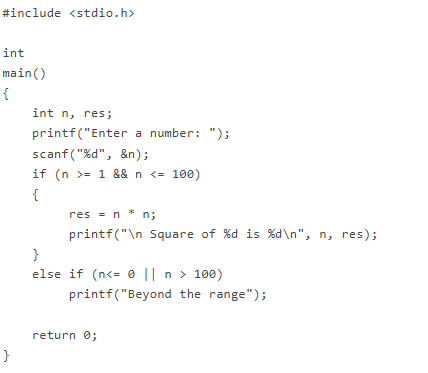

## Objectives

**After completing this experiment you will be able to:**

- Learn about different techniques of testing a software
- Design unit test cases to verify the functionality and locate bugs, if any.

## Theory

### Software Testing

Testing software is an important part of the development life cycle of a software. It is an expensive activity. Hence, appropriate testing methods are necessary for ensuring the reliability of a program. According to the ANSI/IEEE 1059 standard, the definition of testing is the process of analyzing a software item, to detect the differences between existing and required conditions i.e. defects/errors/bugs and to evaluate the features of the software item.

The purpose of testing is to verify and validate a software and to find the defects present in a software. The purpose of finding those problems is to get them fixed.

- **Verification** is the checking or we can say the testing of software for consistency and conformance by evaluating the results against pre-specified requirements.
- **Validation** looks at the systems correctness, i.e. the process of checking that what has been specified is what the user actually wanted.
- **Defect** is a variance between the expected and actual result. The defect’s ultimate source may be traced to a fault introduced in the specification, design, or development (coding) phases.

### Standards for Software Test Documentation
IEEE 829-1998 is known as the 829 Standard for Software Test Documentation. It is an IEEE standard that specifies the form of a set of documents for use in software testing [i]. There are other different standards discussed below.

- IEEE 1008, a standard for unit testing
- IEEE 1012, a standard for Software Verification and Validation
- IEEE 1028, a standard for software inspections
- IEEE 1044, a standard for the classification of software anomalies
- IEEE 1044-1, a guide to the classification of software anomalies
- IEEE 830, a guide for developing system requirements specifications
- IEEE 730, a standard for software quality assurance plans
- IEEE 1061, a standard for software quality metrics and methodology
- IEEE 12207, a standard for software life cycle processes and life cycle data
- BS 7925-1, a vocabulary of terms used in software testing
- BS 7925-2, a standard for software component testing

### Testing Frameworks
Following are the different testing frameworks:

- jUnit - for Java unit test 
- Selenium - is a suite of tools for automating web applications for software testing purposes, plugin for Firefox 
- HP QC - is the HP Web-based test management tool. It familiarizes with the process of defining releases, specifying requirements, planning tests, executing tests, tracking defects, alerting on changes, and analyzing results. It also shows how to customize project 
- IBM Rational - Rational software has a solution to support business sector for designing, implementing and testing software 

### Need for Software Testing
There are many reasons for why we should test software, such as:

- Software testing identifies the software faults. The removal of faults helps reduce the number of system failures. Reducing failures improves the reliability and the quality of the systems.
- Software testing can also improves the other system qualities such as maintainability, usability, and testability.
- In order to meet the condition that the last few years of the 20th century systems had to be shown to be free from the ‘millennium bug’.
- In order to meet the different legal requirements.
- In order to meet industry specific standards such as the Aerospace, Missile and Railway Signaling standards.

### Test Cases and Test Suite
A test case describes an input descriptions and an expected output descriptions. Input are of two types: preconditions (circumstances that hold prior to test case execution) and the actual inputs that are identified by some testing methods. The set of test cases is called a test suite. We may have a test suite of all possible test cases.

### Types of Software Testing
Testing is done in every stage of software development life cycle, but the testing done at each level of software development is different in nature and has different objectives. There are different types of testing, such as stress testing, volume testing, configuration testing, compatibility testing, recovery testing, maintenance testing, documentation testing, and usability testing. Software testing are mainlyof following types 

1. Unit Testing
2. Integration Testing
3. System Testing

#### **Unit Testing**

Unit testing is done at the lowest level. It tests the basic unit of software, that is the smallest testable piece of software. The individual component or unit of a program are tested in unit testing. Unit testing are of two types.

- **Black box testing**: This is also known as **functional testing** , where the test cases are designed based on input output values only. There are many types of Black Box Testing but following are the prominent ones.
  - **Equivalence class partitioning**: In this approach, the domain of input values to a program is divided into a set of equivalence classes. e.g. Consider a software program that computes whether an integer number is even or not that is in the range of 0 to 10. Determine the equivalence class test suite. There are three equivalence classes for this program. - The set of negative integer - The integers in the range 0 to 10 - The integer larger than 10

  - **Boundary value analysis** : In this approach, while designing the test cases, the values at boundaries of different equivalence classes are taken into consideration. e.g. In the above given example as in equivalence class partitioning, a boundary values based test suite is { 0, -1, 10, 11 }

- **White box testing**: It is also known as **structural testing**. In this testing, test cases are designed on the basis of examination of the code.This testing is performed based on the knowledge of how the system is implemented. It includes analyzing data flow, control flow, information flow, coding practices, exception and error handling within the system, to test the intended and unintended software behavior. White box testing can be performed to validate whether code implementation follows intended design, to validate implemented security functionality, and to uncover exploitable vulnerabilities.This testing requires access to the source code. Though white box testing can be performed any time in the life cycle after the code is developed, but it is a good practice to perform white box testing during the unit testing phase.

#### **Integration Testing**
Integration testing is performed when two or more tested units are combined into a larger structure. The main objective of this testing is to check whether the different modules of a program interface with each other properly or not. This testing is mainly of two types:

- Top-down approach
- Bottom-up approach

In bottom-up approach, each subsystem is tested separately and then the full system is tested. But the top-down integration testing starts with the main routine and one or two subordinate routines in the system. After the top-level ‘skeleton’ has been tested, the immediately subroutines of the ‘skeleton’ are combined with it and tested.

#### **System Testing**
System testing tends to affirm the end-to-end quality of the entire system. System testing is often based on the functional / requirement specification of the system. Non-functional quality attributes, such as reliability, security, and maintainability are also checked. There are three types of system testing

- **Alpha testing** is done by the developers who develop the software. This testing is also done by the client or an outsider with the presence of developer or we can say tester.
- **Beta testing** is done by very few number of end users before the delivery, where the change requests are fixed, if the user gives any feedback or reports any type of defect.
- **User Acceptance testing** is also another level of the system testing process where the system is tested for acceptability. This test evaluates the system's compliance with the client requirements and assess whether it is acceptable for software delivery

An error correction may introduce new errors. Therefore, after every round of error-fixing, another testing is carried out, i.e. called regression testing. Regression testing does not belong to either unit testing, integration testing, or system testing, instead, it is a separate dimension to these three forms of testing.

#### **Regression Testing**

The purpose of regression testing is to ensure that bug fixes and new functionality introduced in a software do not adversely affect the unmodified parts of the program [2]. Regression testing is an important activity at both testing and maintenance phases. When a piece of software is modified, it is necessary to ensure that the quality of the software is preserved. To this end, regression testing is to retest the software using the test cases selected from the original test suite.

##### **Example**
Write a program to calculate the square of a number in the range 1-100

##### **Output**

 Inputs               Outputs  
I1 : -2		O1 :  Beyond the range  
I2 :  0 	O2 :  Beyond the range   
I3 :  1		O3 :  Square of 1 is 1  
I4 : 100	O4 :  Square of 100 is 10000  
I5 : 101    O5 :  Beyond the range  
I6 : 4      O6 :  Square of 4 is 16  
I7 : 62		O7 :  Square of 62 is 3844  

##### **Test Cases**

T1 : {I1 ,O1}  
T2 : {I2 ,O2}  
T3 : {I3, O3}  
T4 : {I4, O4}  
T5 : {I5, O5}  
T6 : {I6, O6}  
T7 : {I7, O7}

### Some Remarks
A prevalent misconception among the beginners is that one should be concerned with testing only after coding ends. Testing is, in fact, not a phase towards the end. It is rather a continuous process. The efforts for testing should begin in the form of preparation of test cases after the requirements have been finalized. The Software Requirements Specification (SRS) document captures all features to be expected from the system. The requirements so identified here should serve as a basis towards preparation of the test cases. Test cases should be designed in such a way that all target features could be verified. However, testing a software is not only about proving that it works correctly. Successful testing should also point out the bugs present in the system, if any.

